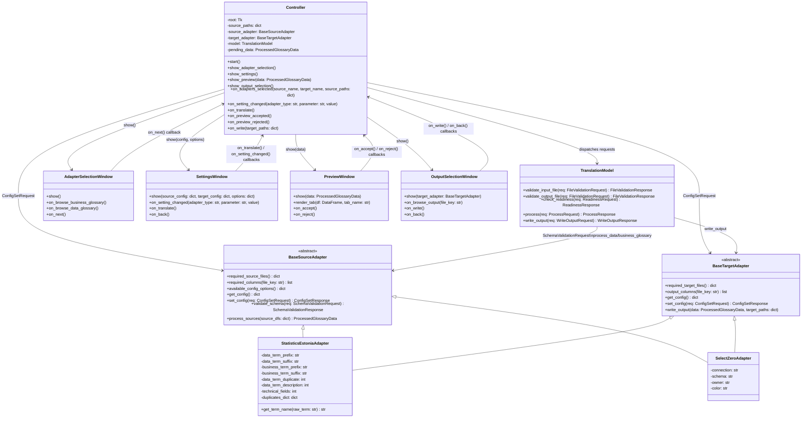
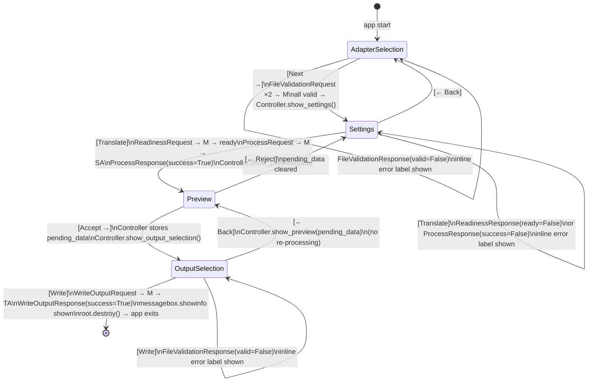
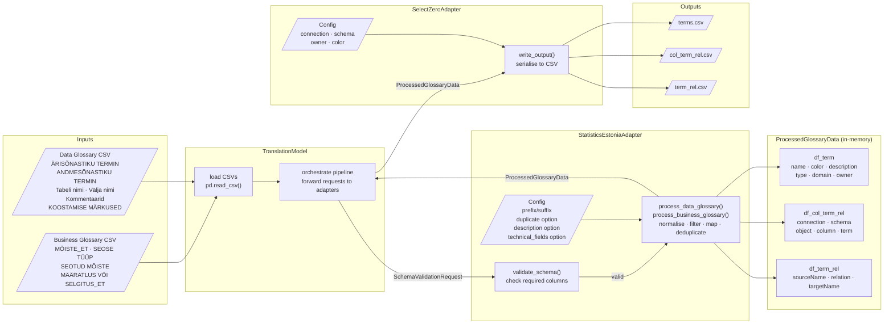

# Metadata Migration Tool — Specification

## Overview

A GUI application that converts metadata from Statistics Estonia's DCAT 3.0-based data description format into SelectZero data management platform import files. Users supply a **business glossary** and a **data glossary** (both semicolon-delimited CSV), configure translation options, and generate three output CSVs ready for SelectZero import.

The architecture follows **Model-View-Controller** with a **request-response** messaging contract between layers and an **adapter pattern** that isolates all source-format and target-format specifics behind abstract interfaces, keeping the model format-agnostic. The View layer is implemented as a **tkinter GUI** comprising four sequential windows managed by the Controller.

---

## File Structure

```
hobby_projects/
├── main.py                                  # Entry point: creates Tk root, wires MVC, starts mainloop
├── controller.py                            # Controller: window navigation, app state, request dispatch
├── model.py                                 # Model: file validation, CSV I/O, translation orchestration
├── messages.py                              # Named tuple definitions (all request/response types)
├── adapters/
│   ├── __init__.py
│   ├── base_source_adapter.py               # ABC for source-format adapters
│   ├── base_target_adapter.py               # ABC for target-format adapters
│   ├── statistics_estonia_adapter.py        # Concrete adapter (source + target): Statistics Estonia DCAT 3.0
│   └── select_zero_adapter.py               # Concrete adapter (source + target): SelectZero import format
├── gui/
│   ├── __init__.py
│   ├── adapter_selection_window.py          # Window 1: adapter choice + input file paths
│   ├── settings_window.py                   # Window 2: adapter configuration + trigger translation
│   ├── preview_window.py                    # Window 3: results tables, accept / reject
│   └── output_selection_window.py           # Window 4: output file paths + write
├── test_model.py                            # pytest unit tests
├── test_business_glossary.csv               # Sample business glossary input (ärisõnastik)
├── test_data_glossary.csv                   # Sample data glossary input (andmesõnastik)
└── test archive/
    ├── ppa_business_glossary.csv
    ├── ppa_data_glossary.csv
    ├── test_andmekirjeldus.csv
    ├── test_andmekirjeldus_short.csv
    ├── test_andmekirjeldus_short2.csv
    ├── test_arisonastik.csv
    ├── test_arisonastik_short.csv
    └── test_arisonastik_short2.csv
```

---

## Architecture

### MVC Layer Responsibilities

| Layer | File(s) | Responsibilities |
|---|---|---|
| **View** | `gui/` package | Four `tk.Frame` subclasses (one per window) hosted in a single `Tk()` root. Each frame renders its own layout using tkinter widgets, captures user events, and delegates all actions to the Controller via callback methods — no business logic, no state beyond `StringVar`/`IntVar` widget variables |
| **Controller** | `controller.py` | Owns the `Tk` root and all four window instances; holds application state (input file paths, active adapter instances, `pending_data` between preview and output); navigates between windows; builds and dispatches requests; handles window callbacks |
| **Model** | `model.py` | Validate file paths, load CSVs, drive the translation pipeline, delegate format-specific work to adapters via requests |
| **Source Adapter** | `adapters/base_source_adapter.py` + any concrete adapter | Own source-format schema definition, hold source-side configuration, validate source schema, process source DataFrames into a normalised intermediate form |
| **Target Adapter** | `adapters/base_target_adapter.py` + any concrete adapter | Own output-format schema definition, hold connection/display configuration, write normalised intermediate DataFrames to target-specific output files |

Concrete adapters (`statistics_estonia_adapter.py`, `select_zero_adapter.py`) implement **both** `BaseSourceAdapter` and `BaseTargetAdapter`, so either can be selected as the source, the target, or both in a single translation run. |

### Class Diagram



---

## Request-Response Contracts (`messages.py`)

All inter-layer communication uses **named tuples**. No layer reaches into another layer's internal state directly.

```python
from collections import namedtuple

# --- File validation ---
# Controller → Model
FileValidationRequest  = namedtuple('FileValidationRequest',  ['path', 'file_type'])
# file_type: 'input' | 'output'
FileValidationResponse = namedtuple('FileValidationResponse', ['valid', 'error'])

# --- Configuration mutation ---
# Controller → SourceAdapter or TargetAdapter
ConfigSetRequest  = namedtuple('ConfigSetRequest',  ['parameter', 'value'])
ConfigSetResponse = namedtuple('ConfigSetResponse', ['success', 'error'])

# --- Input readiness check (before processing; output paths checked separately) ---
# Controller → Model
ReadinessRequest  = namedtuple('ReadinessRequest',  [
    'source_paths', 'connection'
])
# source_paths: dict[str, str] — maps file role key (from source_adapter.required_source_files) to absolute path
ReadinessResponse = namedtuple('ReadinessResponse', ['ready', 'errors'])

# --- Schema validation (Model-internal, forwarded to SourceAdapter) ---
SchemaValidationRequest  = namedtuple('SchemaValidationRequest',  ['source_dfs'])
# source_dfs: dict[str, DataFrame] — same keys as source_paths
SchemaValidationResponse = namedtuple('SchemaValidationResponse', ['valid', 'errors'])

# --- Intermediate data (SourceAdapter → Model → PreviewWindow → OutputSelectionWindow) ---
ProcessedGlossaryData = namedtuple('ProcessedGlossaryData', ['df_term', 'df_col_term_rel', 'df_term_rel'])

# --- Translation processing (load CSVs + run adapters; no file writing) ---
# Controller → Model  (triggered when SettingsWindow “Translate” is clicked)
ProcessRequest  = namedtuple('ProcessRequest',  [
    'source_paths', 'source_adapter', 'target_adapter'
])
# source_paths: dict[str, str] — maps file role key to absolute path
ProcessResponse = namedtuple('ProcessResponse', ['success', 'errors', 'data'])
# data: ProcessedGlossaryData on success, None on failure

# --- Output file writing (separate step; triggered from OutputSelectionWindow) ---
# Controller → Model
WriteOutputRequest  = namedtuple('WriteOutputRequest',  [
    'data', 'target_paths', 'target_adapter'
])
# target_paths: dict[str, str] — maps file role key (from target_adapter.required_target_files) to absolute path
WriteOutputResponse = namedtuple('WriteOutputResponse', ['success', 'errors', 'output_files'])
# output_files: list[str] — absolute paths written (one per required_target_files key, in insertion order); empty list on failure
```

---

## Adapter Interface Specifications

### `BaseSourceAdapter` (ABC)

Defines everything specific to a **source metadata format**.

| Method / Property | Signature | Description |
|---|---|---|
| `required_source_files` | `@property → dict[str, str]` | Maps each source file role key (e.g. `'business_glossary'`) to a human-readable label used by Window 1 to dynamically build file-path entries |
| `required_columns` | `(file_key: str) → list[str]` | Returns the column names the CSV for the given file role must contain |
| `available_config_options` | `@property → dict[str, dict[int, str]]` | Maps each config parameter name to a `{option_int: description_str}` dict; used by `SettingsWindow` to build `OptionMenu` labels |
| `get_config()` | `→ dict` | Returns current configuration state |
| `set_config(req)` | `ConfigSetRequest → ConfigSetResponse` | Updates one config parameter; returns error if value is invalid |
| `validate_schema(req)` | `SchemaValidationRequest → SchemaValidationResponse` | Checks that each DataFrame in `source_dfs` contains all required columns for its role |
| `process_sources(source_dfs)` | `dict[str, DataFrame] → ProcessedGlossaryData` | Normalises, filters, deduplicates, and maps all source DataFrames into the intermediate form; the Model calls this with the fully-loaded dict |

### `BaseTargetAdapter` (ABC)

Defines everything specific to a **target platform format**.

| Method / Property | Signature | Description |
|---|---|---|
| `required_target_files` | `@property → dict[str, str]` | Maps each output file role key to a human-readable label used by Window 4 to dynamically build file-path entries |
| `output_columns` | `(file_key: str) → list[str]` | Returns the column names the output CSV for the given file role will contain; used by `PreviewWindow` to build Treeview columns |
| `get_config()` | `→ dict` | Returns current connection/display configuration |
| `set_config(req)` | `ConfigSetRequest → ConfigSetResponse` | Updates one config parameter |
| `write_output(data, target_paths)` | `ProcessedGlossaryData, dict[str,str] → None` | Writes all output CSVs in the target format; `target_paths` maps each file role key (from `required_target_files`) to an absolute path |

### `StatisticsEstoniaAdapter` (concrete adapter — source + target)

Implements both `BaseSourceAdapter` and `BaseTargetAdapter`. Owns all Statistics Estonia DCAT 3.0-specific logic: Estonian column names, field classification markers, relation type mapping, and the four configurable processing strategies (see Configuration Parameters section). As a source: `required_source_files` returns `{'business_glossary': 'Business Glossary', 'data_glossary': 'Data Glossary'}`; `process_sources` internally runs the data-glossary and business-glossary pipelines in sequence, then merges their results via `pd.concat`; `seen_terms` deduplication for business concepts is scoped to the business-glossary pass only (a collision with a data term name does not suppress the concept row, since `type` values differ: `'Concept'` vs `'Term'`). As a target: `required_target_files` and `output_columns` expose the Statistics Estonia schema for writing; `write_output` serialises `ProcessedGlossaryData` back to Statistics Estonia-compatible CSVs.

### `SelectZeroAdapter` (concrete adapter — source + target)

Implements both `BaseSourceAdapter` and `BaseTargetAdapter`. Owns SelectZero import format specifics: output column names, semicolon-delimited UTF-8 encoding, and the connection/schema/owner/color parameters. As a target: `required_target_files` returns `{'terms': 'Terms file', 'col_term_rel': 'Column–term relations file', 'term_rel': 'Term relations file'}`; `output_columns` returns the appropriate column list for each key (matching the Output section of the Data Model); `write_output` writes all output CSVs. As a source: `required_source_files`, `required_columns`, `validate_schema`, and `process_sources` expose the SelectZero schema for reading, allowing SelectZero exports to be used as a source in a translation.

---

## GUI Windows

The View layer consists of four `tk.Frame` subclasses hosted inside a **single `Tk()` root window** owned by the Controller. Window transitions are achieved by destroying the current frame and packing the next; the root window title updates to reflect the active screen. Each frame class receives a reference to the Controller at construction and registers its event callbacks on the Controller's public methods.

Only the Python standard library is used: `tkinter`, `tkinter.ttk`, `tkinter.filedialog`, `tkinter.messagebox`.

---

### Window 1 — Adapter Selection (`adapter_selection_window.py`)

**Purpose:** Choose source and target adapter formats and supply both input CSV file paths. This is the entry point of the application; no translation parameters are set here.

**Widgets:**

| Widget | Type | Behaviour |
|---|---|---|
| Title label | `ttk.Label` | Static heading "Data Catalog Translator" |
| Source format label + dropdown | `ttk.Label` + `ttk.Combobox` | Populated from all classes that are subclasses of `BaseSourceAdapter`; default `StatisticsEstoniaAdapter`; on change, file-path entries are rebuilt from the new adapter's `required_source_files` |
| Target format label + dropdown | `ttk.Label` + `ttk.Combobox` | Populated from all classes that are subclasses of `BaseTargetAdapter`; default `SelectZeroAdapter`; since all concrete adapters implement both ABCs, the same set of adapters appears in both dropdowns and the user may pick the same adapter for source and target |
| Source file path entries (dynamic) | `ttk.Label` + `ttk.Entry` (`StringVar`) + `ttk.Button` "Browse" per entry | One row per key in `source_adapter.required_source_files`; label text is the display label from that dict; Browse opens `filedialog.askopenfilename(filetypes=[("CSV files", "*.csv")])` |
| Error label | `ttk.Label` (red foreground) | Shows `FileValidationResponse.error` when validation fails; hidden otherwise |
| Next button | `ttk.Button` "Next →" | Disabled until all source file path entries are non-empty; calls `Controller.on_adapters_selected()` passing `source_paths` dict |

**Layout:**
```
┌────────────────────────────────────────────────────┐
│  Data Catalog Translator                            │
├────────────────────────────────────────────────────┤
│  Source format:  [ Statistics Estonia         ▼ ]  │
│  Target format:  [ SelectZero                 ▼ ]  │
├────────────────────────────────────────────────────┤
│  ‹dynamic: one row per required_source_files key›    │
│  Business Glossary: [ path/to/file.csv ] [ Browse ]│
│  Data Glossary:     [ path/to/file.csv ] [ Browse ]│
├────────────────────────────────────────────────────┤
│  ⚠ Error message shown here (if any)               │
│                                      [ Next →    ] │
└────────────────────────────────────────────────────┘
```

---

### Window 2 — Settings (`settings_window.py`)

**Purpose:** Configure all source and target adapter parameters, then trigger the translation pipeline. Errors (validation failures, schema errors, read errors) are shown inline without leaving this window.

**Widgets:**

| Widget | Type | Behaviour |
|---|---|---|
| Source settings frame | `ttk.LabelFrame` "Source: \<adapter name\>" | Groups all `StatisticsEstoniaAdapter` config fields |
| Prefix/suffix entries (×4) | `ttk.Entry` (`StringVar`) | On `<FocusOut>` calls `Controller.on_setting_changed('source', param, value)`; if `ConfigSetResponse(success=False)`, the entry reverts to display the previous valid value and the error is shown inline |
| Duplicate strategy | `ttk.OptionMenu` (`IntVar`) | Options built from `SA.available_config_options()["data_term_duplicate"]`; on change calls `on_setting_changed` |
| Description strategy | `ttk.OptionMenu` (`IntVar`) | Options from `SA.available_config_options()["data_term_description"]` |
| Technical fields strategy | `ttk.OptionMenu` (`IntVar`) | Options from `SA.available_config_options()["technical_fields"]` |
| Target settings frame | `ttk.LabelFrame` "Target: \<adapter name\>" | Groups all `SelectZeroAdapter` config fields |
| Connection / schema / owner / color entries | `ttk.Entry` (`StringVar`) | On `<FocusOut>` calls `Controller.on_setting_changed('target', param, value)` |
| Error/status label | `ttk.Label` (red) | Shows accumulated errors from `ReadinessResponse` or `ProcessResponse` |
| Back button | `ttk.Button` "← Back" | Calls `Controller.show_adapter_selection()`; current adapter instances are discarded — re-selecting adapters on Window 1 creates fresh instances with default settings |
| Translate button | `ttk.Button` "Translate" | Calls `Controller.on_translate()`; disabled while processing |

**Layout:**
```
┌──────────────────────────────────────────────────────┐
│  Settings                                             │
├─── Source: Statistics Estonia ───────────────────────┤
│  Data term prefix:     [           ]                  │
│  Data term suffix:     [           ]                  │
│  Business term prefix: [           ]                  │
│  Business term suffix: [           ]                  │
│  Duplicate handling:   [ Option 2 — suffix      ▼ ]  │
│  Description source:   [ Option 3 — combined    ▼ ]  │
│  Technical fields:     [ Option 1 — include all ▼ ]  │
├─── Target: SelectZero ───────────────────────────────┤
│  Connection:  [                        ]              │
│  Schema:      [ public                 ]              │
│  Owner:       [                        ]              │
│  Color:       [                        ]              │
├──────────────────────────────────────────────────────┤
│  ⚠ Error message (if any)                            │
│  [ ← Back ]                          [ Translate ]   │
└──────────────────────────────────────────────────────┘
```

---

### Window 3 — Translation Preview (`preview_window.py`)

**Purpose:** Show the three output DataFrames as read-only tables before any files are written. The user either rejects the result (returns to Settings with state preserved) or accepts it (proceeds to output path selection).

**Widgets:**

| Widget | Type | Behaviour |
|---|---|---|
| Notebook | `ttk.Notebook` | Three tabs: "Terms", "Column–Term Relations", "Term Relations" |
| Row count label (×3) | `ttk.Label` | Shows `"{n} rows"` in each tab header area |
| Treeview (×n) | `ttk.Treeview` (`show="headings"`) | One per tab; columns sourced from `target_adapter.output_columns(file_key)` for each key in `target_adapter.required_target_files`; all columns read-only |
| Vertical scrollbar (×n) | `ttk.Scrollbar` (`orient=VERTICAL`) | Linked to corresponding Treeview via `yscrollcommand` |
| Horizontal scrollbar (×n) | `ttk.Scrollbar` (`orient=HORIZONTAL`) | Linked to corresponding Treeview via `xscrollcommand` |
| Reject button | `ttk.Button` "← Reject" | Calls `Controller.on_preview_rejected()` → returns to Settings; `pending_data` cleared |
| Accept button | `ttk.Button` "Accept →" | Calls `Controller.on_preview_accepted()` → Controller stores data in `pending_data`, opens Output Selection |

**Column sets per tab** (shown for `SelectZeroAdapter`; actual columns are adapter-driven via `output_columns`):

| Tab | Treeview columns |
|---|---|
| Terms | `name`, `color`, `description`, `type`, `domain`, `owner` |
| Column–Term Relations | `connection`, `schema`, `object`, `column`, `term` |
| Term Relations | `sourceName`, `relation`, `targetName` |

**Layout:**
```
┌──────────────────────────────────────────────────────────────┐
│  Translation Preview                                          │
├──────────────────────────────────────────────────────────────┤
│ [ Terms (42 rows) ] [ Col–Term Rel (42) ] [ Term Rel (15) ]  │
│ ┌─────────────────────────────────────────────────────────┐▲ │
│ │ name           │ color │ description      │ type │ owner │  │
│ │────────────────────────────────────────────────────────│  │
│ │ kasutajakonto  │       │ primery key //   │ Term │       │  │
│ │ ...            │ ...   │ ...              │ ...  │ ...   │▼ │
│ └─────────────────────────────────────────────────────────┘  │
│  ◄──────────────────────────────────────────────────────►    │
├──────────────────────────────────────────────────────────────┤
│  [ ← Reject ]                                [ Accept →  ]   │
└──────────────────────────────────────────────────────────────┘
```

---

### Window 4 — Output Selection (`output_selection_window.py`)

**Purpose:** Choose output file paths and write `pending_data` to disk via the target adapter. The Controller passes the active `target_adapter` to `show()` so the window can build one path entry per key in `target_adapter.required_target_files`. All output paths are validated before writing begins.

**Widgets:**

| Widget | Type | Behaviour |
|---|---|---|
| Output file path entries (dynamic) | `ttk.Label` + `ttk.Entry` (`StringVar`) + `ttk.Button` "Browse" per entry | One row per key in `target_adapter.required_target_files`; label text is the display label from that dict; Browse opens `filedialog.asksaveasfilename(defaultextension=".csv", filetypes=[("CSV files", "*.csv")])` |
| Error label | `ttk.Label` (red) | Shows `FileValidationResponse.error` for any invalid output path |
| Back button | `ttk.Button` "← Back" | Calls `Controller.show_preview(pending_data)` — re-renders preview without re-running translation |
| Write button | `ttk.Button` "Write" | Validates all paths via `FileValidationRequest`, then sends `WriteOutputRequest` to Model |
| Success dialog | `messagebox.showinfo` | Shown on `WriteOutputResponse(success=True)`; lists all written file paths; after the dialog is dismissed, the application exits via `root.destroy()` |

**Layout:**
```
┌──────────────────────────────────────────────────────────┐
│  Save Output Files                                        │
├──────────────────────────────────────────────────────────┤│  ‹dynamic: one row per required_target_files key›          ││  Terms file:            [ path/to/terms.csv ] [ Browse ] │
│  Column–term rel. file: [ path/to/ctr.csv   ] [ Browse ] │
│  Term relation file:    [ path/to/tr.csv    ] [ Browse ] │
├──────────────────────────────────────────────────────────┤
│  ⚠ Error message (if any)                                │
│  [ ← Back ]                              [   Write    ]  │
└──────────────────────────────────────────────────────────┘
```

---

## Data Model

### Input: Business Glossary (`ärisõnastik`)

| Column | Type | Description |
|---|---|---|
| `MÕISTE_ET` | string | Business concept name (Estonian) |
| `SEOSE TÜÜP` | string | Relation type: `SEOTUD`, `KUULUB GRUPPI`, `LAIEM`, `KITSAM` |
| `SEOTUD MÕISTE` | string (nullable) | Related concept name |
| `MÄÄRATLUS VÕI SELGITUS_ET` | string (nullable) | Definition or explanation |

### Input: Data Glossary (`andmesõnastik`)

| Column | Type | Description |
|---|---|---|
| `ÄRISÕNASTIKU TERMIN` | string (nullable) | Linked business term(s), comma-separated |
| `ANDMESÕNASTIKU TERMIN` | string (nullable) | Data term name |
| `Tabeli nimi` | string | Database table name |
| `Välja nimi` | string | Database column/field name |
| `Kommentaarid` | string | Database-level commentary |
| `KOOSTAMISE MÄRKUSED` | string | Glossary author commentary; contains `"tehniline tunnus"` for technical fields and `"ei ole kasutuses"` for unused fields |

### Output: Terms (`terms.csv`)

| Column | Source |
|---|---|
| `name` | Prefixed/suffixed data term or business concept name |
| `color` | Configured `color` parameter |
| `description` | Resolved per `data_term_description` option (data terms) or `MÄÄRATLUS VÕI SELGITUS_ET` (concepts) |
| `type` | `"Term"` for data terms, `"Concept"` for business concepts |
| `domain` | Always empty (extensibility placeholder) |
| `owner` | Configured `owner` parameter |

### Output: Column–Term Relations (`col_term_rel.csv`)

| Column | Source |
|---|---|
| `connection` | Configured `connection` parameter |
| `schema` | Configured `schema` parameter |
| `object` | `Tabeli nimi` |
| `column` | `Välja nimi` |
| `term` | Resolved data term name |

### Output: Term–Term Relations (`term_rel.csv`)

| Column | Source |
|---|---|
| `sourceName` | For data-glossary links: `ÄRISÕNASTIKU TERMIN` value with `business_term_prefix`/`business_term_suffix` applied; for business glossary relations: `MÕISTE_ET` with `business_term_prefix`/`business_term_suffix` applied |
| `relation` | Mapped relation string (see below) |
| `targetName` | Data term name or related business concept name |

**Relation type mapping:**

| Input (`SEOSE TÜÜP`) | Output (`relation`) |
|---|---|
| `KUULUB GRUPPI` | `"Belongs to group"` |
| `SEOTUD` | `"Related to"` |
| `LAIEM` | `"Child of"` |
| `KITSAM` | `"Parent of"` |
| Data glossary link | `"Related to"` |
| Any other value | Row skipped — no `term_rel` entry is added |

---

## Configuration Parameters

Configuration parameters are owned by the adapter that needs them. The Controller holds references to the adapter instances and sends `ConfigSetRequest` messages to set individual parameters.

### `StatisticsEstoniaAdapter` configuration

| Parameter | Type | Default | Description |
|---|---|---|---|
| `data_term_prefix` | string | `""` | Prepended to every data term name (2–8 chars when set) |
| `data_term_suffix` | string | `""` | Appended to every data term name (2–8 chars when set) |
| `business_term_prefix` | string | `""` | Prepended to every business concept name |
| `business_term_suffix` | string | `""` | Appended to every business concept name |
| `data_term_duplicate` | int (1–4) | `2` | Duplicate data term handling strategy |
| `data_term_description` | int (1–4) | `3` | Description source strategy |
| `technical_fields` | int (1–4) | `1` | Technical/unused field inclusion strategy |

**Duplicate data term options (`data_term_duplicate`):**

| # | Behaviour |
|---|---|
| 1 | Name set to empty string on all occurrences after the first |
| 2 | Numeric suffix appended (`_2`, `_3`, …) |
| 3 | Keep all duplicates with identical names |
| 4 | Exclude all rows after the first occurrence — both the `df_term` row and the `df_col_term_rel` row are suppressed |

**Description source options (`data_term_description`):**

| # | Behaviour |
|---|---|
| 1 | `Kommentaarid` only (database commentary) |
| 2 | `KOOSTAMISE MÄRKUSED` only (author commentary) |
| 3 | `Kommentaarid // KOOSTAMISE MÄRKUSED` (combined); each NaN field is treated as empty string before joining; if one part is empty, only the non-empty part is used (without the `//` separator); if both are empty, result is `""` |
| 4 | Empty string |

**Technical/unused field options (`technical_fields`):**

| # | Behaviour |
|---|---|
| 1 | Include all fields |
| 2 | Exclude fields marked technical **or** unused |
| 3 | Include technical, exclude unused |
| 4 | Include unused, exclude technical |

**Field classification markers** (detected in `KOOSTAMISE MÄRKUSED` by regex, case-insensitive):

| Marker text | Classification |
|---|---|
| `"tehniline tunnus"` | Technical field |
| `"ei ole kasutuses"` | Unused field |

### `SelectZeroAdapter` configuration

| Parameter | Type | Default | Description |
|---|---|---|---|
| `connection` | string | `""` | SelectZero connection name (required for readiness check) |
| `schema` | string | `"public"` | Database schema name |
| `owner` | string | `""` | Term owner name |
| `color` | string | `""` | Term colour tag in SelectZero |

---

## Application State Diagram

Shows the four GUI windows as states and annotates each transition with the layer responsible and the message exchanged.



---

## Interaction Sequence Diagram

Shows the full GUI event-driven message flow for the two main workflows: configuring a setting and running a complete translation.

```mermaid
sequenceDiagram
    actor User
    participant ASW as AdapterSelectionWindow
    participant SW as SettingsWindow
    participant PW as PreviewWindow
    participant OSW as OutputSelectionWindow
    participant C as Controller
    participant M as Model
    participant SA as StatisticsEstoniaAdapter
    participant TA as SelectZeroAdapter

    Note over C: main.py: root=Tk(); Controller(root)
    C->>ASW: show()

    Note over User,SW: Window 1 → 2
    User->>ASW: selects adapters, browses all source input files
    User->>ASW: clicks "Next →"
    ASW->>C: on_adapters_selected(source, target, source_paths)
    loop for each path in source_paths.values()
        C->>M: FileValidationRequest(path, 'input')
        M-->>C: FileValidationResponse(valid=True, error=None)
    end
    C->>SA: instantiate with source_name
    C->>TA: instantiate with target_name
    C->>SW: show(SA.get_config(), TA.get_config(), SA.available_config_options())

    Note over User,TA: Window 2: configure settings
    User->>SW: changes "Duplicate handling" to option 2
    SW->>C: on_setting_changed('source', 'data_term_duplicate', 2)
    C->>SA: ConfigSetRequest('data_term_duplicate', 2)
    SA-->>C: ConfigSetResponse(success=True, error=None)
    User->>SW: types connection name, focus-out
    SW->>C: on_setting_changed('target', 'connection', 'my_db')
    C->>TA: ConfigSetRequest('connection', 'my_db')
    TA-->>C: ConfigSetResponse(success=True, error=None)

    Note over User,PW: Window 2 → 3
    User->>SW: clicks "Translate"
    SW->>C: on_translate()
    C->>M: ReadinessRequest(source_paths, 'my_db')
    M-->>C: ReadinessResponse(ready=True, errors=[])
    C->>M: ProcessRequest(source_paths, SA, TA)
    M->>SA: SchemaValidationRequest(source_dfs)
    SA-->>M: SchemaValidationResponse(valid=True, errors=[])
    M->>SA: process_sources(source_dfs)
    SA-->>M: ProcessedGlossaryData(df_term, df_ctr, df_tr)
    M-->>C: ProcessResponse(success=True, errors=[], data=merged_data)
    C->>PW: show(merged_data)

    Note over User,C: Window 3: review
    User->>PW: inspects Terms / Col-Term / Term-Rel tabs
    User->>PW: clicks "Accept →"
    PW->>C: on_preview_accepted()
    C->>OSW: show()   [C stores merged_data in pending_data]

    Note over User,TA: Window 4: write output
    User->>OSW: browses all output file paths
    User->>OSW: clicks "Write"
    OSW->>C: on_write(target_paths)
    loop for each path in target_paths.values()
        C->>M: FileValidationRequest(path, 'output')
        M-->>C: FileValidationResponse(valid=True)
    end
    C->>M: WriteOutputRequest(pending_data, target_paths, TA)
    M->>TA: write_output(pending_data, target_paths)
    TA-->>M: (done)
    M-->>C: WriteOutputResponse(success=True, errors=[], output_files=[...])
    C->>OSW: messagebox.showinfo(output_files)
```

---

## Translation Process Flow

The Model orchestrates; all format-specific logic runs inside `StatisticsEstoniaAdapter`.

```mermaid
flowchart TD
    A([Controller sends TranslationRequest]) --> B[Model: check_readiness]
    B -- ReadinessResponse ready=False --> Z([Model returns TranslationResponse\nsuccess=False])
    B -- ready=True --> C[Model: load each CSV from source_paths dict]
    C -- IOError --> Z
    C -- ok --> E[Model → SA: SchemaValidationRequest\nsource_dfs]
    E -- SchemaValidationResponse valid=False --> Z
    E -- valid=True --> F

    subgraph F["SA: process_sources(source_dfs)"]
        direction TB
        F0([iterate source_dfs by role]) --> F0a[process data glossary entries]
        F0a --> F1([for each row]) --> F2{ANDMESÕNASTIKU\nTERMIN is NaN?}
        F2 -- yes --> F1
        F2 -- no --> F3[strip + lowercase → raw_term]
        F3 --> F4[get_term_name\nprefix / suffix / duplicate strategy]
        F4 --> F5{duplicate option=4\nAND count > 1?}
        F5 -- yes --> F1
        F5 -- no --> F6{technical_fields filter\non KOOSTAMISE MÄRKUSED}
        F6 -- excluded --> F1
        F6 -- included --> F7[build description\nfrom description option]
        F7 --> F8[add row to df_term  type='Term']
        F8 --> F9[add row to df_col_term_rel\nTabeli nimi + Välja nimi]
        F9 --> F10{ÄRISÕNASTIKU\nTERMIN is NaN?}
        F10 -- yes --> F1
        F10 -- no --> F11[split by comma]
        F11 --> F12[add each to df_term_rel\nsourceName = business_term_prefix + term + business_term_suffix\nrelation='Related to']
        F12 --> F1
    end

    F --> G

    subgraph G["SA: (continued) process business glossary entries"]
        direction TB
        G1([for each row]) --> G2[build concept name\nbusiness prefix + suffix]
        G2 --> G3{concept already\nin seen_terms?}
        G3 -- yes, skip term row --> G4
        G3 -- no --> G3a[add row to df_term  type='Concept']
        G3a --> G4{SEOTUD MÕISTE\nAND SEOSE TÜÜP\nboth present?}
        G4 -- no → skip relation --> G1
        G4 -- yes --> G5[map SEOSE TÜÜP → relation string]
        G5 --> G5b{relation
recognised?}
        G5b -- no skip --> G1
        G5b -- yes --> G6[add row to df_term_rel]
        G6 --> G1
    end

    G --> MERGE[SA: merge results into single ProcessedGlossaryData\nvia pd.concat]
    MERGE --> H[Model → TA: write_output\nProcessedGlossaryData + paths]
    H --> I[TA: df_term → terms.csv]
    I --> J[TA: df_col_term_rel → col_term_rel.csv]
    J --> K[TA: df_term_rel → term_rel.csv]
    K --> L([Model returns TranslationResponse\nsuccess=True])
```



---

## Dataflow Diagram



---

## Input Validation Rules

### File path validation — `Model.validate_input_file` / `validate_output_file`

Input files (`file_type='input'`):
- Must be an absolute path
- File must exist on disk
- Must have `.csv` extension
- Must be readable as a UTF-8, semicolon-delimited CSV with at least one column

Output files (`file_type='output'`):
- Must have `.csv` extension
- Parent directory must exist
- File must not already exist (no overwrite)

### Readiness check — `Model.check_readiness`
- Both input file paths must be non-empty strings
- `connection` (from `SelectZeroAdapter.get_config()`) must be non-empty

### Write pre-validation — performed by Controller in `on_write()` before sending `WriteOutputRequest`
- All output paths (one per key in `target_adapter.required_target_files`) must be non-empty strings
- All source paths and output paths must all be distinct
- Each output path is validated via `FileValidationRequest(path, 'output')`; all must return `FileValidationResponse(valid=True)` before `WriteOutputRequest` is sent

### Schema validation — `StatisticsEstoniaAdapter.validate_schema`

Business glossary required columns: `MÕISTE_ET`, `SEOSE TÜÜP`, `SEOTUD MÕISTE`, `MÄÄRATLUS VÕI SELGITUS_ET`

Data glossary required columns: `ÄRISÕNASTIKU TERMIN`, `ANDMESÕNASTIKU TERMIN`, `Kommentaarid`, `KOOSTAMISE MÄRKUSED`, `Tabeli nimi`, `Välja nimi`

### Config mutation validation — `StatisticsEstoniaAdapter.set_config` / `SelectZeroAdapter.set_config`
- Option values for integer-keyed options must be within the declared range (1–4)
- String parameters (`connection`, `owner`, `schema`) must be 2–40 characters when non-empty; `connection` must be non-empty to pass the readiness check
- `color` accepts any string 0–40 characters (empty string is valid)
- Prefix/suffix parameters accept empty string `""` (meaning no prefix/suffix) or a non-empty string of 2–8 characters; values of exactly 1 character are rejected

---

## Known Issues in Current Implementation

| Location | Issue | Resolved by refactor? |
|---|---|---|
| `resolve_business_glossary` | `term_list` is re-initialised inside the loop; concept deduplication never triggers | No — must be fixed in `StatisticsEstoniaAdapter.process_business_glossary` using a `seen_terms` set initialised before the loop |
| `resolve_business_glossary` | Guard `if pd.notna(SEOTUD MÕISTE) and pd.notna(SEOSE TÜÜP): continue` has inverted logic — skips relation building when both fields are populated | No — logic must be inverted in the adapter |
| `Translator` class | `df_term`, `df_col_term_rel`, `df_term_rel`, `duplicates_dict` declared at class level (shared mutable state) | **Yes** — `ProcessedGlossaryData` is created fresh on each `process_*` call; no class-level DataFrames |
| `is_correct_input` | `csvfile.close()` called after the `with` block — redundant | **Yes** — validation moves into `Model.validate_input_file` |
| `set_addon` | Length condition allows only 2–8 characters; prevents single-character prefixes | Partially — `StatisticsEstoniaAdapter.set_config` can relax this; minimum should be reconsidered |

---

## Non-Functional Requirements (from thesis)

| ID | Requirement |
|---|---|
| NFR-1 | Input validation must report descriptive error messages identifying which columns are missing |
| NFR-2 | Output files must be UTF-8 encoded, semicolon-delimited CSV files compatible with SelectZero's import format |
| NFR-3 | The tool must not overwrite existing output files |
| NFR-4 | Processing must handle `NaN`/null values in optional fields without crashing |
| NFR-5 | The application must be distributable as a single executable (PyInstaller) |
| NFR-6 | Term name normalisation must be case-insensitive (lowercase before deduplication) |
| NFR-7 | The GUI must use only the Python standard library tkinter (`tkinter`, `tkinter.ttk`, `tkinter.filedialog`, `tkinter.messagebox`) — no third-party GUI framework |
| NFR-8 | All validation and processing errors must be displayed inline within the active window; modal error dialogs are forbidden except for the final write-success confirmation |
| NFR-9 | The "Back" navigation from Window 4 must re-render the Preview from `pending_data` without re-running the translation pipeline |
